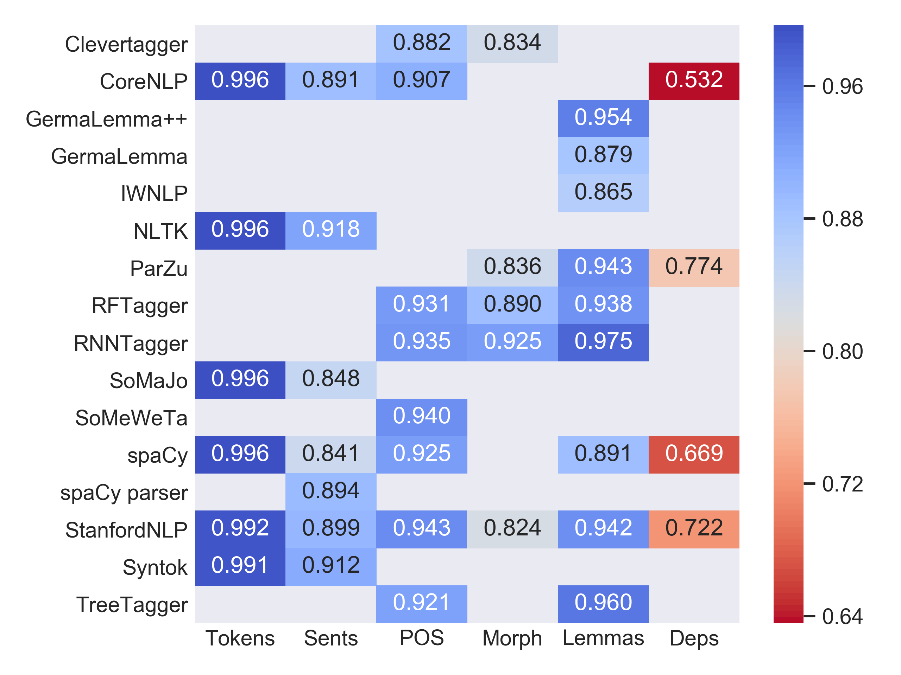

# Evaluating Off-the-Shelf NLP Tools for German

This repository contains the scripts, dataset, and evaluation results from the paper:

Katrin Ortmann, Adam Roussel, and Stefanie Dipper. 2019. Evaluating Off-the-Shelf NLP Tools for German. In _Proceedings of the 15th Conference on Natural Language Processing (KONVENS)_, 212--222. [[pdf]](https://corpora.linguistik.uni-erlangen.de/data/konvens/proceedings/papers/KONVENS2019_paper_55.pdf) [[bib]](https://corpora.linguistik.uni-erlangen.de/data/konvens/proceedings/papers/KONVENS2019_paper_55.bib)

## Contents

- `scripts/`
  - The main scripts which define how the systems are loaded and called (per annotation level): `tokens.py`, `pos.py`, `morph.py`, `lemmas.py`, `depparse.py`
  - `common.py` Document model und morphology format conversion
  - Evaluation scripts: `eval_bounds.py` for tokenization and `eval_annotations.py` for everything else
- `eval/`
  - The results of the evaluation are stored here in two `csv` tables: `results.csv` for the accuracy evaluation and `timing.csv` for the performance evaluation.
  - The plots and tables generated by `scripts/analysis.py` are also stored here.
- `data/`
  - Gold standard datasets (`data/gold/`) and system output (`data/system/`)
  - Each system's output is in an appropriately named subdir, and each of these system-specific subdirs will contain one annotated output file per domain
  - The directory `txt/` contains the unannotated original plaintext files.

## Usage

In theory you can use the provided Makefile to run the experiments, but in practice it is a lot of work to install all of these systems individually. We hope to eventually provide a Dockerfile to make running all of the experiments easier.

However, performing the evaluation (`make evaluate`), i.e. comparing the system output to the gold standard, and calculating performance statistics (`make analysis`) should work, provided you have Numpy, Pandas, Matplotlib, and Seaborn installed.

## Results Preview

A more detailed evaluation can be found in the paper cited above.

## Related

For more on the available off-the-shelf tools and resources for German NLP, see [https://github.com/adbar/German-NLP](https://github.com/adbar/German-NLP).
